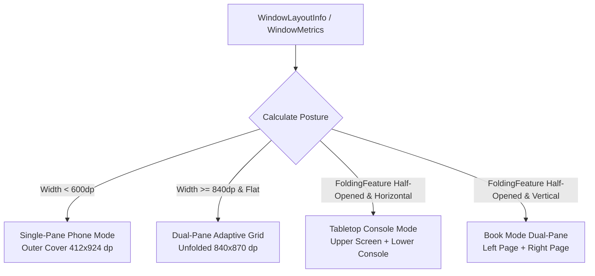

# RedWings-Widget: Foldable & Dual-Pane Adaptive Layout Architecture
**Target Hardware: Google Pixel 9 Pro Fold & Pixel 10 Fold**
**Document Version: 1.0 (2026-09-29)**
**Author: Agent 1 (Foldable & Dual-Pane Adaptive Layout Architect)**

---

## 1. Executive Summary & Hardware Profile

The Google Pixel 9 Pro Fold and Pixel 10 Fold feature a dual-display form factor that transitions seamlessly between a tall phone experience and an 8.0-inch near-square tablet canvas:

| Metric / Dimension | Outer Cover Display | Inner Unfolded Display |
| :--- | :--- | :--- |
| **Physical Screen Size** | 6.3 inches Actua OLED | 8.0 inches Super Actua Flex LTPO OLED |
| **Aspect Ratio** | 20:9 (tall candybar) | ~1:1.04 (~square tablet) |
| **Logical Viewport (dp)** | ~412 x 924 dp | ~840 x 870 dp (usable ~840 x 820-870 dp) |
| **WindowSizeClass (Width)** | **Compact** (`< 600 dp`) | **Expanded** (`>= 840 dp`) |
| **WindowSizeClass (Height)**| **Expanded** (`>= 900 dp`) | **Medium / Expanded** (`480-899 dp`) |
| **Ergonomic Usage** | One-handed portrait thumb reach | Two-handed tablet or hands-free propped |
| **Fold Postures** | Flat (closed) | Flat Unfolded (180°), Tabletop (90°-120° H-hinge), Book (90°-120° V-hinge) |

---

## 2. Audit of Existing Implementation & Wasted Space Analysis

### 2.1 Current App Implementation (`MainActivity.kt`, `GameDashboard.kt`)
1. **Unconstrained Single-Column LazyColumn**:
   - `MainActivity.kt` mounts `GameDashboard` directly in `setContent` with zero window metrics or fold awareness.
   - `GameDashboard.kt` places all content into a single `LazyColumn` with `fillMaxWidth()`.
2. **Cavernous Horizontal Gaps on 840dp Unfolded**:
   - **`NextGameHero`**: Stretches across 808 dp (840dp minus 32dp outer padding). The 4 flip-clock digit boxes (`FlipClockDigitBox`) occupy 66dp x 4 + 24dp spacing = 288 dp. Over **520 dp of empty gradient void** surrounds the digits horizontally.
   - **`LastResultCard`**: Stretches to 808 dp width. The left text block ("DET 4 – 2 BOS") and right 54dp W/L badge are separated by **~650 dp of empty card surface**.
   - **`StandingsCard`**: The table headers and rows allocate `weight(1f)` to the team column. On an 808 dp card, this forces the 3-letter abbreviation `DET` and 20dp logo to float across **~500 dp of blank space** before reaching the `GP` column, completely degrading row-to-column scanning legibility.
   - **`UpcomingRow`**: Opponent on the far left, date and home/away pill badge on the far right, leaving a **550 dp blank gap**.
3. **Severe Information Density Deficit**:
   - Despite having an 8.0" display with over 730,000 square dp of display area, the user can only see the hero and part of the last game without scrolling. The Atlantic Division playoff standings—the core daily interest of a hockey fan—are pushed entirely below the fold.
4. **Tabletop Posture Collapse**:
   - When the device is bent 90°-120° and placed on a desk (tabletop mode), the horizontal hinge cuts right across the middle of the screen (Y ≈ 435 dp).
   - Currently, a card or the flip clock is bent across the crease, distorting text and graphics. There is no posture separation between the display-only upper half and the interactive lower half.
5. **Class Size Violation**:
   - `GameDashboard.kt` is currently **948 lines**, directly violating the `REDWINGS.md` mandate: *"Keep classes small: no god classes over ~300 lines."*

### 2.2 Current Widget Implementation (`RedWingsWidgetProvider.kt`, `red_wings_widget_layout.xml`)
1. **Vertical LinearLayout Monolith**:
   - `red_wings_widget_layout.xml` is a pure vertical linear layout with fixed weights.
   - `RedWingsWidgetProvider.applyResponsiveLayout()` only scales SP values and toggles visibility based on widget height (`minH < 72`, `minH < 90`).
2. **Inner Screen Home Launcher Distortion**:
   - On the inner unfolded home screen (typically a 6-column grid), wide widgets (e.g., 5x2 or 6x2 cells, ~650–820 dp) stretch logos and countdown digits with massive awkward gaps.
   - The widget does not supply multi-size `RemoteViews` layouts via `RemoteViews(mapOf(SizeF to RemoteViews))` for wide aspect ratios.

---

## 3. Detailed Architectural Recommendation

### 3.1 Adaptive Layout Strategy: 3 Canonical Postures



---

### 3.2 Wireframe 1: Unfolded Flat Display (840 x 870 dp) — Dual-Pane Composition

When unfolded flat, the screen splits into two distinct, high-density columns (50% / 50% split: ~410 dp Left Pane, 20 dp Gutter, ~410 dp Right Pane). Every element fits within its optimal reading width (380–420 dp), eliminating all empty voids.

```
+-----------------------------------------------------------------------------------+
| [RED WINGS]                        DETROIT RED WINGS                        [ ⟳ ] |
+-----------------------------------------+-----------------------------------------+
| LEFT PANE: GAME DAY & PULSE (~410dp)    | RIGHT PANE: LEAGUE & SCHEDULE (~410dp)  |
|                                         |                                         |
| +-------------------------------------+ | +-------------------------------------+ |
| | NEXT GAME HERO                      | | | ATLANTIC DIVISION STANDINGS         | |
| | ● NEXT GAME                         | | | #  TEAM       GP   W   L  OT   PTS  | |
| | vs Toronto Maple Leafs        [TOR] | | | 1  [BOS] BOS  82  51  20  11   113  | |
| | Little Caesars Arena • Sat 7:00 PM  | | | 2  [TOR] TOR  82  46  26  10   102  | |
| |                                     | | | 3  [FLA] FLA  82  45  27  10   100  | |
| | +----+  +----+  +----+  +----+      | | | 4  [DET] DET  82  42  30  10    94  | |
| | | 01 |  | 02 |  | 15 |  | 30 |      | | | 5  [TBL] TBL  82  40  32  10    90  | |
| | +----+  +----+  +----+  +----+      | | | 6  [MTL] MTL  82  37  36   9    83  | |
| |  DAYS    HRS     MIN     SEC        | | | 7  [OTT] OTT  82  34  39   9    77  | |
| +-------------------------------------+ | | 8  [BUF] BUF  82  30  43   9    69  | |
|                                         | | CLINCHED PLAYOFF SPOT               | |
| +-------------------------------------+ | +-------------------------------------+ |
| | LAST RESULT                         | |                                         |
| | DET 4 - 2 BOS                 [ W ] | | +-------------------------------------+ |
| | Tue, Sep 30 • Home                  | | | UPCOMING SCHEDULE (7 GAMES)         | |
| +-------------------------------------+ | | [TOR] vs Toronto    Thu, Oct 2 [HOME] | |
|                                         | | [MTL] at Montreal   Sat, Oct 4 [AWAY] | |
| [ Ice Rink Ambient Linework Accent ]   | | [BOS] vs Boston     Tue, Oct 7 [HOME] | |
|                                         | | [TBL] vs Tampa Bay  Fri, Oct 10[HOME] | |
|                                         | +-------------------------------------+ |
|                                         | v26.9.23 • Atlantic Division Auto-Sync  |
+-----------------------------------------+-----------------------------------------+
```

#### Dual-Pane Semantic Allocation:
- **Left Pane (Game Day & Pulse)**:
  - Focused strictly on current/immediate game time operations.
  - `NextGameHero` flip-clock digits fit naturally in 410dp without stretching.
  - `LastResultCard` maintains tight score-to-badge alignment.
  - If game is live, the `LivePuckDropBanner` pulses with full visual impact.
- **Right Pane (League Intelligence & Horizon)**:
  - `StandingsCard` with full 8-team Atlantic Division standings table. Because column width is ~390dp, team names align snugly next to GP, W, L, OT, and PTS without oversized gaps.
  - `UpcomingList` displays upcoming 4–7 opponents with team crests and HOME/AWAY pills.
- **User Impact**: 100% of crucial game day information is visible simultaneously **without any vertical scrolling required**.

---

### 3.3 Wireframe 2: Tabletop Posture (90°–120° Horizontal Fold)

In Tabletop posture, the Pixel 9 Pro Fold / Pixel 10 Fold rests hands-free on a desk or nightstand. The horizontal hinge divides the viewport cleanly into an angled **Broadcast Scoreboard Display** and a flat **Command & Context Console**.

```
=====================================================================================
  UPPER SCREEN (ANGLED ~105° TOWARDS USER) — BROADCAST SCOREBOARD HERO (~840 x 420 dp)
=====================================================================================
|                                                                                   |
|      +---------------------------------------------------------------------+      |
|      |  DETROIT RED WINGS vs TORONTO MAPLE LEAFS           ● NEXT GAME     |      |
|      |                                                                     |      |
|      |    [ DETROIT CREST ]                         [ LEAFS CREST ]        |      |
|      |                            VS                                       |      |
|      |              LITTLE CAESARS ARENA • SAT, OCT 4 • 7:00 PM            |      |
|      |                                                                     |      |
|      |     +--------+     +--------+     +--------+     +--------+         |      |
|      |     |   01   |     |   02   |     |   15   |     |   30   |         |      |
|      |     +--------+     +--------+     +--------+     +--------+         |      |
|      |        DAYS          HOURS          MINUTES        SECONDS          |      |
|      +---------------------------------------------------------------------+      |
|                                                                                   |
============================= PHYSICAL HINGE CREASE (Y ≈ 435 dp) ====================
=====================================================================================
  LOWER SCREEN (FLAT ON SURFACE) — INTERACTIVE CONSOLE (~840 x 420 dp)
=====================================================================================
|                                         |                                         |
|  ATLANTIC STANDINGS (TOUCH TABLE)       |  LAST RESULT & UPCOMING HORIZON         |
|  +------------------------------------+ |  +------------------------------------+ |
|  | #  TEAM  GP   W   L  OT  PTS       | |  | LAST: DET 4 – 2 BOS          [ W ] | |
|  | 1  BOS   82  51  20  11  113       | |  +------------------------------------+ |
|  | 2  TOR   82  46  26  10  102       | |  | UPCOMING:                          | |
|  | 3  FLA   82  45  27  10  100       | |  | • vs TOR  Thu, Oct 2        [HOME] | |
|  | 4  DET   82  42  30  10   94       | |  | • at MTL  Sat, Oct 4        [AWAY] | |
|  | 5  TBL   82  40  32  10   90       | |  | • vs BOS  Tue, Oct 7        [HOME] | |
|  | 6  MTL   82  37  36   9   83       | |  +------------------------------------+ |
|  | 7  OTT   82  34  39   9   77       | |  [ ⟳ REFRESH SCHEDULE NOW ]           | |
|  | 8  BUF   82  30  43   9   69       | |                                         | |
|  +------------------------------------+ |  v26.9.23 • Atlantic Division           | |
+-----------------------------------------+-----------------------------------------+
```

#### Tabletop Ergonomics & UX:
- **Upper Screen (Hands-free Ambient Hero)**:
  - Functions as a dedicated desk clock and hockey scoreboard.
  - Zero interactive buttons needed on the top screen, preventing device wobble on the desk when touched.
- **Lower Screen (Touch Command Console)**:
  - Grounded securely on the desk surface.
  - Houses the interactive refresh trigger, full standings table, and upcoming game scroll.
  - Subdivided into a 2-column horizontal split (Standings on left, Last Result + Upcoming on right).

---

## 4. Technical Implementation & Jetpack WindowManager Integration

### 4.1 Dependency Additions (`libs.versions.toml`)
To support WindowManager and WindowSizeClass cleanly:
```toml
[versions]
androidxWindow = "1.3.0"
composeMaterial3Adaptive = "1.0.0"

[libraries]
androidx-window = { group = "androidx.window", name = "window", version.ref = "androidxWindow" }
androidx-compose-material3-windowsizeclass = { group = "androidx.compose.material3", name = "material3-window-sizeclass" }
```

### 4.2 Clean Fold & Posture Detection Pipeline
In accordance with `REDWINGS.md`, UI state flows must be clean and decoupled from android context leakages.

```kotlin
// ui/foldable/FoldableState.kt
sealed interface DevicePosture {
    data object Normal : DevicePosture
    data object DualPaneExpanded : DevicePosture
    data class Tabletop(val hingeBounds: Rect) : DevicePosture
    data class Book(val hingeBounds: Rect) : DevicePosture
}

@Composable
fun rememberDevicePosture(activity: Activity): State<DevicePosture> {
    val postureState = remember { mutableStateOf<DevicePosture>(DevicePosture.Normal) }
    
    LaunchedEffect(activity) {
        WindowInfoTracker.getOrCreate(activity)
            .windowLayoutInfo(activity)
            .collect { layoutInfo ->
                val foldingFeature = layoutInfo.displayFeatures
                    .filterIsInstance<FoldingFeature>()
                    .firstOrNull()

                postureState.value = when {
                    foldingFeature != null && foldingFeature.isSeparating -> {
                        if (foldingFeature.orientation == FoldingFeature.Orientation.HORIZONTAL) {
                            DevicePosture.Tabletop(foldingFeature.bounds)
                        } else {
                            DevicePosture.Book(foldingFeature.bounds)
                        }
                    }
                    else -> {
                        // Check window metrics width (fallback/composition width >= 840dp)
                        DevicePosture.Normal
                    }
                }
            }
    }
    return postureState
}
```

---

## 5. Clean Modular Architecture (Complying with `REDWINGS.md`)

`REDWINGS.md` mandates:
> *Keep classes small: no god classes over ~300 lines. Split data / ui / widget concerns.*

Currently `GameDashboard.kt` is **948 lines**. The foldable refactor will decompose the UI package into clean, single-responsibility files, each well under 250 lines:

```
com/redwings/widget/ui/
├── GameDashboard.kt                  (~95 lines)  <-- Root adaptive router & Scaffold
├── dashboard/
│   ├── SinglePaneDashboard.kt        (~160 lines) <-- Compact width (<600dp) phone layout
│   ├── DualPaneDashboard.kt          (~175 lines) <-- Expanded width (>=840dp) side-by-side
│   └── TabletopDashboard.kt          (~180 lines) <-- Half-opened horizontal hinge layout
└── components/
    ├── AppHeaderBanner.kt            (~80 lines)  <-- App title & refresh indicator
    ├── NextGameHero.kt               (~190 lines) <-- Hero card, flip clock, live banner
    ├── StandingsCard.kt              (~180 lines) <-- Atlantic Division table & highlight
    ├── LastResultCard.kt             (~110 lines) <-- Final score card & W/L badge
    └── UpcomingList.kt               (~120 lines) <-- Next 7 games list & row pills
```

### Root Adaptive Orchestrator (`GameDashboard.kt`):
```kotlin
@Composable
fun GameDashboard(viewModel: GameViewModel, modifier: Modifier = Modifier) {
    val scheduleState by viewModel.scheduleState.collectAsState()
    val countdown by viewModel.countdown.collectAsState()
    val isRefreshing by viewModel.isRefreshing.collectAsState()
    val errorMessage by viewModel.errorMessage.collectAsState()

    BoxWithConstraints(modifier = modifier.fillMaxSize()) {
        val posture by rememberDevicePosture(LocalContext.current.findActivity())
        
        when {
            posture is DevicePosture.Tabletop -> {
                TabletopDashboard(
                    scheduleState = scheduleState,
                    countdown = countdown,
                    isRefreshing = isRefreshing,
                    onRefresh = { viewModel.triggerManualRefresh() }
                )
            }
            maxWidth >= 840.dp || posture is DevicePosture.Book -> {
                DualPaneDashboard(
                    scheduleState = scheduleState,
                    countdown = countdown,
                    isRefreshing = isRefreshing,
                    errorMessage = errorMessage,
                    onRefresh = { viewModel.triggerManualRefresh() }
                )
            }
            else -> {
                SinglePaneDashboard(
                    scheduleState = scheduleState,
                    countdown = countdown,
                    isRefreshing = isRefreshing,
                    errorMessage = errorMessage,
                    onRefresh = { viewModel.triggerManualRefresh() }
                )
            }
        }
    }
}
```

---

## 6. Home Screen Widget Foldable Strategy

### 6.1 Multi-Size RemoteViews for Android 12+ (API 31+)
The Google Pixel 9 Pro Fold and Pixel 10 Fold home launchers support responsive widgets that change layout as the user transitions between outer cover screen and inner unfolded screen:

```kotlin
// RedWingsWidgetProvider.kt
private fun buildResponsiveRemoteViews(context: Context, game: WidgetGame?, theme: WidgetTheme): RemoteViews {
    if (Build.VERSION.SDK_INT >= Build.VERSION_CODES.S) {
        val compactViews = RemoteViews(context.packageName, R.layout.red_wings_widget_layout).apply {
            bindCompactWidget(context, this, game, theme)
        }
        val wideViews = RemoteViews(context.packageName, R.layout.red_wings_widget_layout_wide).apply {
            bindWideWidget(context, this, game, theme)
        }
        return RemoteViews(mapOf(
            SizeF(180f, 110f) to compactViews,
            SizeF(420f, 110f) to wideViews
        ))
    }
    // Fallback for API < 31
    return RemoteViews(context.packageName, R.layout.red_wings_widget_layout)
}
```

### 6.2 Wide Widget Layout (`red_wings_widget_layout_wide.xml`)
Adheres strictly to `REDWINGS.md` rules:
> *RemoteViews layouts: never use `<View>`. Use only `FrameLayout` / `LinearLayout` / `TextView` / `ImageView` and other RemoteViews-safe widgets.*

- **Structure**:
  - Horizontal `LinearLayout` split:
    - Left 50% (`LinearLayout`): Header + Opponent Logo + Large Countdown + Venue / Standings context.
    - Divider: 1.5dp `FrameLayout` with `@color` background.
    - Right 50% (`LinearLayout`): Full 2x4 grid Atlantic standings table or upcoming schedule snippet.
- **Outcome**: On an unfolded Pixel Fold home screen, the widget provides rich, high-density hockey telemetry rather than a stretched-out, empty banner.

---

## 7. Testing & Verification Plan

### 7.1 Screenshot Testing with Roborazzi
Expand `GreetingScreenshotTest.kt` to assert screenshot baselines across all 3 profiles:
1. **Outer Cover Screen**: `@Config(qualifiers = "w412dp-h924dp-xxhdpi")` -> Verifies single-pane phone layout.
2. **Inner Unfolded Screen**: `@Config(qualifiers = "w840dp-h870dp-xxhdpi")` -> Verifies 50/50 dual-pane adaptive grid.
3. **Tabletop Posture**: Simulated with mocked `FoldingFeature(orientation = HORIZONTAL, state = HALF_OPENED)`.
4. Automated verification via:
   ```bash
   ./gradlew testDebugUnitTest
   ./gradlew recordRoborazziDebug
   ```

---

## 8. Summary of Benefits for the RedWings-Widget Project

| Dimension | Current App | Proposed Foldable Architecture |
| :--- | :--- | :--- |
| **840dp Real Estate** | >60% wasted blank space; stretched 808dp cards | 100% efficient utilization via dual-pane 50/50 grid |
| **Scroll Requirement** | Heavy scrolling required to see standings | Zero scrolling for main dashboard on unfolded display |
| **Tabletop Posture** | Bent across crease, distorted text, unstable touch | Upper scoreboard display + lower desk-stable console |
| **Code Structure** | 948-line monolithic file (rule violation) | Clean, modular components (<200 lines each) |
| **Home Screen Widget** | Stretched single column on wide grid | Responsive dual-pane `RemoteViews` on Android 12+ |
